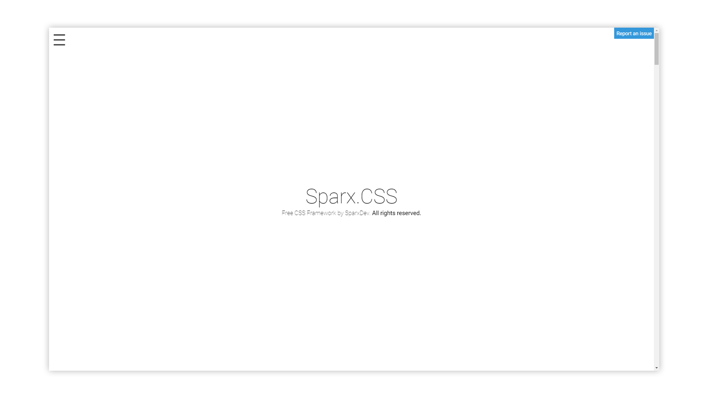

# Sparx.CSS
CSS Framework with some cool features, yo!
### Screenshot

# How to use
Add this stylesheet to your ``<head>`` tag in your HTML File:
```html
<link rel="stylesheet" href="http://sparxdev.de/sparxcss/lib/sparx.css">
```
